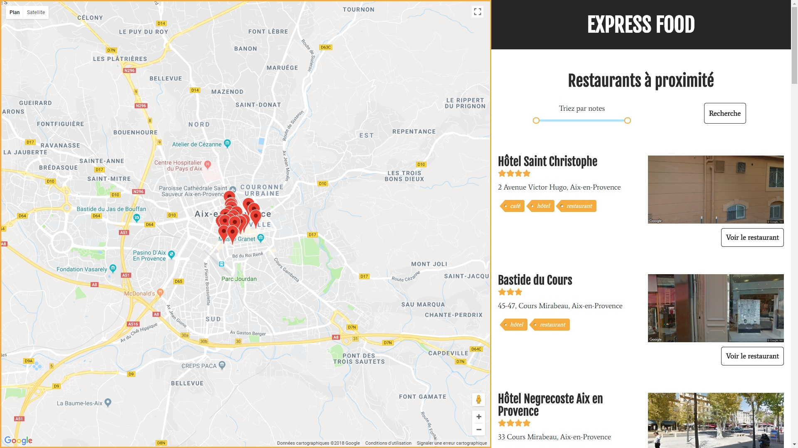

# EasyFoodApp

Voir tous les [screenshots](docs/screenshots.md).

the seventh project of my path with OpenClassroom, the point is to use external API on a restaurants recommendations application.

## Directives
- A map with Google Map API
- A list of restaurant with comments and stars
- Display user position on map
- Option to add comments and restaurants to the list and make them appear on the map

## Tools
- React.js
- React router
- Webpack
- Babel (for transpiling Es6 syntax)
- Prettier (for syntax check)
- Less

# Installation
`npm ci`

## Start Local server
`npm run start`

## Url
http://localhost:8083/
